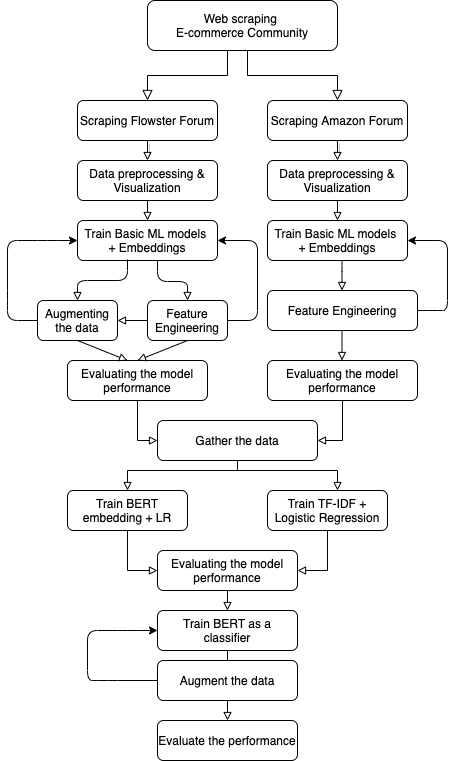

# Machine Learning Team 4

**Period:** June 2020  
**What:** Virtual Internship at STEMAway  

## About Team 4

Project Lead: @Sara_El-Ateif  
PM Lead: @rohit  
Participant: @kdglider  
Participant: @Gabriel_Jai  
Participant: @yeszoey  
Participant: @Khushali_Verma  
Participant: @ananya_de  
Participant: @mahmed51  
Participant: @Kitty_Gu  
Participant: @whuang19  
Observer: @Shalini_Kumari  
Observer: @WillP  
Observer: @Merron_Tecleab  
Observer: @fxc2000  
14 interns : 2 lead, 8 participants, 4 observers 

## Goal of the project

Classify a given post from a specific forum from the E-commerce DiscourseHub Community into its appropriate category.

## Project Workflow

## Folders structure

- `team_amazon_work` and `team_flowster_work` folders contain the web scraping and basic modeling code and notebooks as well as the Flowster and Amazon data.

- `advanced_modeling` folder contain the work performed on the merged data (Flowster data + Amazon data) with the notebooks of the BERT and TF-IDF+LR models training and evaluation as well as the merged data.

- `resources` folder contain some resources shared worth as a basic reference on how to perform web scraping and textual data preprocessing.

- `ColabGitOperations.ipynb` notebook that details how to link your github to Colab and your drive so you can push and pull changes from the repo.

## Presentation that summarizes our work

Please checkout our work following [the presentation link](https://docs.google.com/presentation/d/1ddxR9e26OegIKwxpr0FbCGO8kl1JpjtfPwrybG2jhX8/edit?usp=sharingp).  
You will find the pdf version in the assets folder as well.
